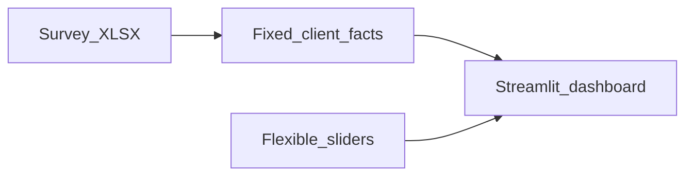

# Fixed vs flexible parameters

Conceptual split (aligned with generalized acquisition docs).

## Fixed (from survey / evidence)

Source: **`questionnaire_01_input.xlsx`** sheets **填写** or **English**; row key = column **`#`** (e.g. `INT4`, `B2`, `J1`).

| Layer | Examples |
|--------|-----------|
| Metadata | INT1–INT7: project id, currency, baseline year, respondent |
| Scope & inventory | A1–A7: geography, lamp counts, fixture mix, age |
| Money baseline | B1–B4, B6, B8–B9: annual spend splits |
| Energy | C1–C2, **C4 + C4a–C4e**, C5–C7, C9–C12: kWh, tariffs flat/TOU, hours, dimming |
| O&M | D2–D10: contracts, tickets, repair times |
| Civil / CAPEX priors | E1–E8: trenching, per-light costs, hidden costs |
| **Incumbent EMC** | **J1–J6**: coverage, term, mechanic, who pays power, constraints, cash |
| Structure / appetite | G1, G11–G12; **H7, H10**; **I2, I5**; **K6** |

Treat these as **locked defaults** in the app unless the product owner enables an explicit “override survey” debug mode.

## Flexible (Streamlit / internal)

| Examples | Typical UI |
|----------|------------|
| Effective tariff λ, escalation | `st.number_input` / slider |
| Analysis horizon, discount (if added) | `st.number_input` |
| Fee split (client vs owner / ESCO) | `st.slider` |
| Energy savings %, “our” CAPEX, platform fee | sidebar |
| Scenario toggles (EMC vs LaaS narrative) | radio / select |

Initialize sliders from **survey-derived defaults** where possible (e.g. C4 as initial λ); label clearly as **sensitivity**, not re-collection.

## Diagram

